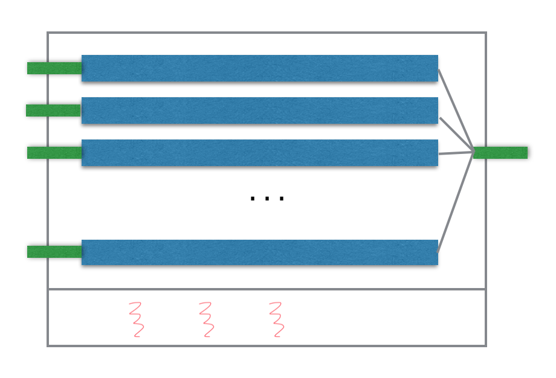
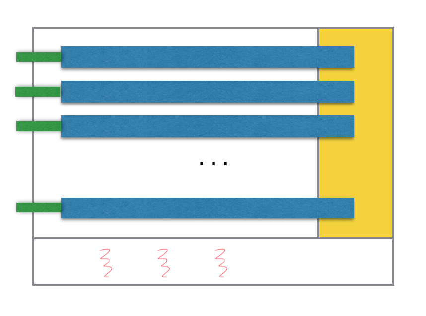
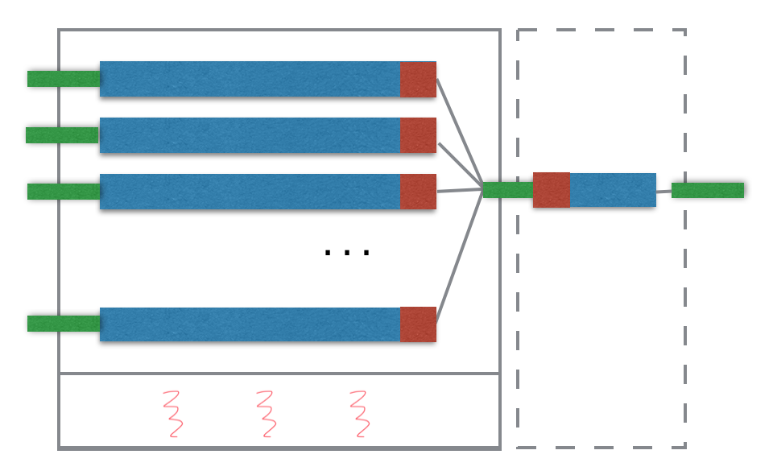

# Poppy
*poppy* is dataframe library for java, which provides common SQL operations (e.g. select, from, where, group by, order by, distinct) to process data in java.

Unlike other dataframe libraries, which keep all the data in memory, *poppy* process data in streaming manager. That is, it is more similar as [Java8 Stream library](https://docs.oracle.com/javase/8/docs/api/java/util/stream/package-summary.html), but relational version.

Here is a simple example. We have a `Student` class

```java
public class Student {
    private int studentId;
    private String name;
    private int grade;
    private int room;
    private int height;
    private int weight;
    ...
}
```

In SQL, we have a query like this

```sql
select 
    grade, 
    room, 
    avg(weight) as weight, 
    avg(height) as height
from Student
group by grade, room
order by grade, room
```

Here is the *Poppy*'s version 

```java
List<Student> students = ...;

DataFrame
.from(students, Student.class)
.groupby("grade", "room")
.aggregate(
    avgLong("weight").as("weight"),
    avgLong("height").as("height"))
.sort("grade", "room")
.print();
```


# Getting Started

## Requirement
Java 8 or higher

## Dependency

Maven

```
<dependency>
  <groupId>io.tenmax</groupId>
  <artifactId>poppy</artifactId>
  <version>0.1.7</version>
  <type>pom</type>
</dependency>
```

Gradle

```
compile 'io.tenmax:poppy:0.1.7'
```
## Features

1. Support the most common operations in SQL. e.g. select, from, where, group by, order by, distinct
2. Support the most common aggregation functions in SQL. e.g. *avg()*, *sum()*, *count()*, *min()*, *max()*
3. **Custom aggregation functions.** by  [java.util.stream.Collector](https://docs.oracle.com/javase/8/docs/api/java/util/stream/Collector.html)
4. **Partition support.** Partition is the unit of parallelism. Multiple partitions allow you processing data concurrently.
5. **Multi-threaded support**. For CPU-bound jobs, it leverages all your CPU resources for better performance; for IO-bound jobs, it reduces the waiting time, and take adventages of better concurrency.
6. Suitable for both **batch** and **streaming** scenario.
7. **Lightweight**. Comparing to [Spark DataFrame API](https://spark.apache.org/docs/latest/sql-programming-guide.html), it is much more lightweight to embed in your application.
8. **Stream-based design**. Comparing to [joinery](https://github.com/cardillo/joinery), which keeps the whole data in memory. *Poppy*'s streaming behaviour allows limited memory to process huge volume of data.

## Documentation

[JavaDoc](docs/javadoc/index.html)

# Input

There are two kinds of input.

1. DataFrame.from(Class\<T> clazz, java.util.Iterable... iterables)
2. DataFrame.from(io.tenmax.DataSource dataSource)

The first one uses [JavaBean Conventions](https://en.wikipedia.org/wiki/JavaBeans) to define the table schema. This is the simplest way to create a dataframe

```
List<Student> students = ...;

DataFrame df = DataFrame.from(Student.class, students);
```

The second one allows you most flexible way to define the data source. In data source, it should define 

1. The schema (by a list of columns)
2. Partition count
3. The iterators for specified partition
4. The mapping from one data to data in all columns.

```
DataSource dataSource = ...

DataFrame df = DataFrame.from(dataSource);
```

# Output

There are several ways to output the data

1. Iterator
2. forEach
3. toList
4. toMap
5. DataFrame.to(DataSink dataSink)

The first two methods are provided from *java.util.Iterable* interface. So you can use `for(T t: dataFrame)` to iterate through the dataframe.

`toList` and `toMap` provide quick methods to output dataframe to collections. Both provide the list version and reflection version. The later exports the data by the [JavaBean conventions](https://en.wikipedia.org/wiki/JavaBeans). `toMap` method should define grouping columns by `groupby` method to define the key of map.

The latest version provides the most flexible version of output. Th results are called back directly in the multi-threaded context, offering the best level of parallelism to output the results to destination, just like Hadoop does.

# Operations

## Project
Project is the same as `select` in SQL. Project maps one column to another name, or merges multiple columns to one column. In the following example, we use SQL as analogy to explain each operation.

*SQL*

```sql
select name, weight, height from student;
```

*Poppy*

```java
df.project("name", "weight", "height");
```

Another example is to alias a name to a column.

*SQL*

```sql
select 
    name, 
    weight as w, 
    height / 10 as h
from student;
```

*Poppy*

```java
import static io.tenmax.poppy.SpecUtils.*;

df.project(
   col("name"),
   colMap("weight").as("w"),
   colMap("height", Float.class, (Integer height) -> (height / 10f)).as("h"))
```

## Filter
Filter is the same as `where` or `having` in SQL. Filter is used to keep the rows which pass the rule.

*SQL*

```sql
select * from Student where height > 170;
```

*Poppy*

```java
df.filter(row -> row.getInteger("height") >= 170);
```


## Aggregation

*SQL*

```sql
select 
    count(*) as c,
    avg(weight) as weight,
    avg(height) as height
from Student;
```
*Poppy*

```java
df.aggregate(
	count().as("c")
    avgLong("weight").as("weight"),
    avgLong("height").as("height")
);
```

You can define custom aggregation by Java8 [Collector](https://docs.oracle.com/javase/8/docs/api/java/util/stream/Collector.html) interface.

*Poppy*

```java
df.aggregate(
    aggreMap("weight", Integer.class, Collectors.summingInt((Integer i) -> i)).as("wi"))
)
```

Of course, poppy supports aggregate with grouping.

*SQL*
```sql
select 
    grade, 
    room, 
    avg(weight) as weight, 
    avg(height) as height
from Student
group by grade, room
```
*Poppy*

```java
df
.groupby("grade","room")
.aggregate(
    avgLong("weight").as("weight"),
    avgLong("height").as("height"));
```

## Sort

Sort the dataframe by columns.

*SQL*

```sql
select *
from Student
order by weight, height;
```
*Poppy*

```java
df.sort("weight", "height");
```

Specify the sorting orders.

*SQL*

```sql
select *
from Student
order by weight asc, height desc;
```
*Poppy*

```java
import static io.tenmax.poppy.SpecUtils.*;

df.sort(asc("weight"), desc("height"));
```


## Distinct

Select the unique records by columns.

*SQL*

```sql
select distinct grade, room from Student;
```
*Poppy*

```java
df.distinct("grade", "room");
```

# Partition and Parallelism

Partition is the unit of parallelism. To leverage the multicore computing power, we can provide more than one partitions in the data sources. And in dataframe, we use the `parallel(n)` to define number of threads running in the thread pool

```java
DataFrame
.from(myDataSource)
.parallel(4)
.aggregate(...)
.forEach(row -> {/*...*/})
```

## Execution Context

*Poppy* introduces the concept of execution context. One execution context contains a thread pool with *n* threads and *m* partitions. It treat one partition as a task, and one thread only processses task at the same time. Internally, it make the projection, filtering, accumulation of aggregation as a pipeline. Once all tasks complete, the thread pool shutdown and release all the resources. 

The following diagram is an example of multiple partition with 3 threads in pool. And the final results would pipe the result to the queue and be pulled by the caller thread. 



Another case is the DataFrame output the result to a DataSink directly. Here the result is invoked in the threads of execution context.



If there is no parallel threads defined in the execution context, the default behaviour is to use the caller thread to iterate through all the partition sequentially. So there is no thread spawned in this case.


For some operations, they would create a new execution context. Such as, aggregation, sort, distinct. Currently, they would create a new context with only one partition. The following example is a aggregation example, the partition data would be accumulated as a accumulated value and be combined all the results to the final result.


